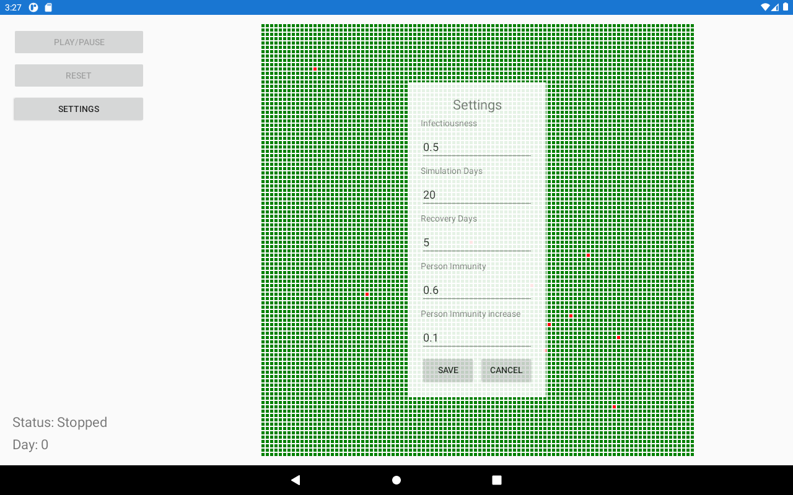
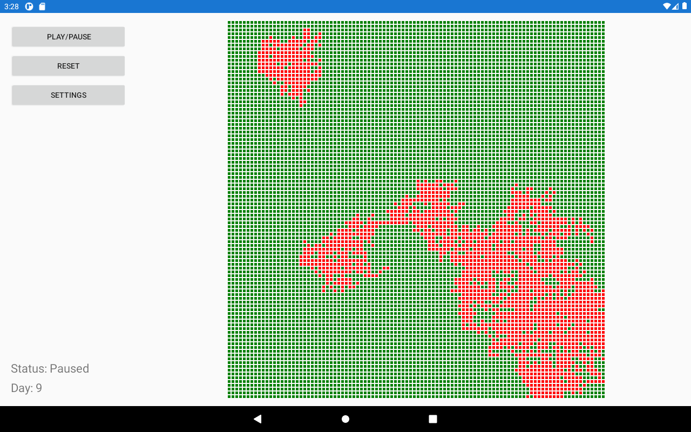
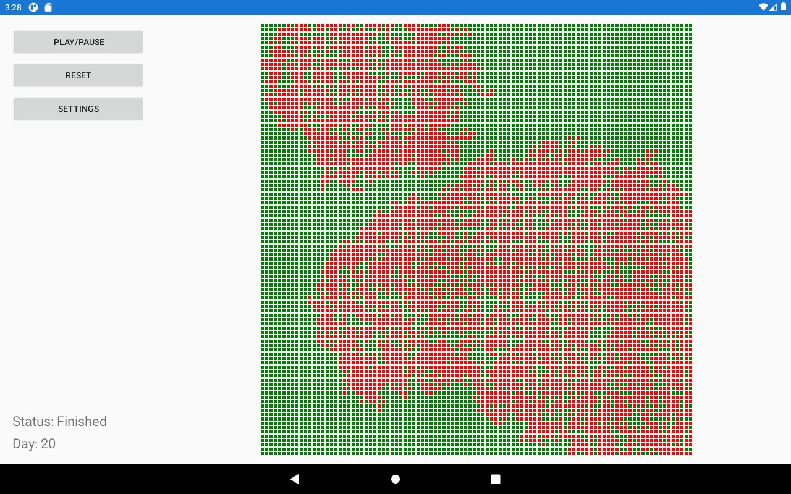

# Infection Simulator
Infection simulator is a simple project that tries to simulate in a basic way spreading of disease in a small population. The simulator features settings, where you can tweak different properties to control the way disease is working, control buttons for starting, pausing and resetting simulator, and some basic statistics for selected person, which you can see by clicking on desired tile. The project was developed using [SkiaSharp](https://docs.microsoft.com/en-us/xamarin/xamarin-forms/user-interface/graphics/skiasharp/).

Settings menu

Simulation running

Tile selected

Simulation finished

# Notes
* While simple absolutelayout + boxview might work for smaller grids (~40x40) anything bigger than that will significantly hurt performance of the app
* The grid in this example is 100x100. I found that it is reasonable size for observing spreading of disease and still being able to select the tiles in the emulator. On real device the tiles would have to be much bigger to comfortably tap them
* The app was tested on android emulator
* The app was not tested on ios devices/emulators
